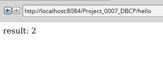
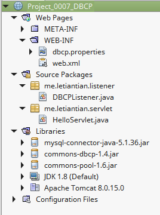

使用数据库连接池
---

目前比较常见的连接池实现有DBCP、C3P0,Tomcat_JDBC等。

本文使用的连接池是DBCP。

进入[http://commons.apache.org/proper/commons-dbcp/download_dbcp.cgi](http://commons.apache.org/proper/commons-dbcp/download_dbcp.cgi)下载`Apache Commons DBCP for JDBC `，[http://commons.apache.org/proper/commons-pool/download_pool.cgi](http://commons.apache.org/proper/commons-pool/download_pool.cgi)中下载`Apache Commons Pool`，[http://dev.mysql.com/downloads/connector/j/](http://dev.mysql.com/downloads/connector/j/)下载MySQL的JDBC驱动。

若下载出现问题，可以到一些Maven仓库中下载。例如[http://mvnrepository.com/](http://mvnrepository.com/)、[http://maven.oschina.net](http://maven.oschina.net)。


## 数据库准备
MySQL 5.6。

```sql
--创建数据库
CREATE DATABASE IF NOT EXISTS `test` DEFAULT CHARSET utf8 COLLATE utf8_general_ci;
USE `test`;
--创建table
CREATE TABLE IF NOT EXISTS user
(
	`id` int AUTO_INCREMENT,
	`name` varchar(255),
 	`email` varchar(255),
 	`age` varchar(255),
	`passwd` varchar(255),
	PRIMARY KEY (`id`),
 	UNIQUE KEY (`name`),
	UNIQUE KEY (`email`)
) ENGINE=InnoDB DEFAULT CHARSET=utf8;
---插入若干数据
INSERT INTO user (`name`, `email`, `age`, `passwd`)
VALUES ('user01', 'user01@163.com', 20, password('123'));

INSERT INTO user (`name`, `email`, `age`, `passwd`)
VALUES ('user02', 'user02@163.com', 20, password('456'));
```

## 示例1

目录结构如下：  


**web.xml源码：**  
```xml
<?xml version="1.0" encoding="UTF-8"?>
<web-app version="3.1" xmlns="http://xmlns.jcp.org/xml/ns/javaee" xmlns:xsi="http://www.w3.org/2001/XMLSchema-instance" xsi:schemaLocation="http://xmlns.jcp.org/xml/ns/javaee http://xmlns.jcp.org/xml/ns/javaee/web-app_3_1.xsd">

    <servlet-mapping>  
        <servlet-name>default</servlet-name>
        <url-pattern>*.jpg</url-pattern>
    </servlet-mapping>

    <servlet-mapping>  
        <servlet-name>default</servlet-name>
        <url-pattern>*.png</url-pattern>   
    </servlet-mapping>  

    <servlet-mapping>    
        <servlet-name>default</servlet-name>  
        <url-pattern>*.js</url-pattern>  
    </servlet-mapping>  

    <servlet-mapping>    
        <servlet-name>default</servlet-name>    
        <url-pattern>*.css</url-pattern>   
    </servlet-mapping>

    <session-config>
        <session-timeout>
            30
        </session-timeout>
    </session-config>

</web-app>
```

**dbcp.properties源码：**  
```plain
driverClassName=com.mysql.jdbc.Driver
url=jdbc:mysql://localhost:3306/test
username=root
password=123456
initialSize=2
maxActive=15
maxIdle=2
minIdle=1
maxWait=30000
```
这些配置的解释请见[BasicDataSource Configuration Parameters](http://commons.apache.org/proper/commons-dbcp/configuration.html)。

**HelloServlet.java源码：**  
```java
package me.letiantian.servlet;

import java.io.IOException;
import java.io.PrintWriter;
import java.sql.Connection;
import java.sql.PreparedStatement;
import java.sql.ResultSet;
import java.util.Properties;
import javax.servlet.annotation.WebServlet;
import javax.servlet.http.HttpServlet;
import javax.servlet.http.HttpServletRequest;
import javax.servlet.http.HttpServletResponse;
import javax.sql.DataSource;

import org.apache.commons.dbcp.BasicDataSourceFactory;


@WebServlet(name = "HelloServlet", urlPatterns = {"/hello"})
public class HelloServlet extends HttpServlet {

    protected void processRequest(HttpServletRequest request, HttpServletResponse response) throws IOException {
        response.setContentType("text/html;charset=UTF-8");
        PrintWriter out = response.getWriter();
        try{
            Properties properties=new Properties();
            properties.load(getServletContext().getResourceAsStream("/WEB-INF/dbcp.properties"));
            DataSource dataSource = BasicDataSourceFactory.createDataSource(properties);
            Connection conn = dataSource.getConnection();
            String sql = "select 1+1 as result;";
            PreparedStatement pstmt = conn.prepareStatement(sql);
            ResultSet rs = pstmt.executeQuery();

            if (rs.next()) {
                int result = rs.getInt("result");
                out.println("result: " + result);
            }

            rs.close();
            pstmt.close();
            conn.close();

        } catch (Exception ex) {
            out.println(ex.getMessage());
        }
    }

    @Override
    protected void doGet(HttpServletRequest request, HttpServletResponse response) throws IOException {
        processRequest(request, response);
    }


    @Override
    protected void doPost(HttpServletRequest request, HttpServletResponse response) throws IOException {
        processRequest(request, response);
    }

}
```

运行项目，浏览器访问`http://localhost:8084/Project_0007_DBCP/hello`：  



## 改进：将初始化的连接池放到Servlet上下文中
上面代码中是再servlet中初始化连接池，更好的方法是再Listener中初始化，并将连接池作为属性放入servlet上下文中。

源文件以及代码有所变化，项目结构如下：  
  

DBCPListener.java内容如下：
```java
package me.letiantian.listener;

import java.util.Properties;
import javax.servlet.ServletContext;
import javax.servlet.ServletContextEvent;
import javax.servlet.ServletContextListener;
import javax.servlet.annotation.WebListener;
import javax.sql.DataSource;
import org.apache.commons.dbcp.BasicDataSourceFactory;

@WebListener
public class DBCPListener implements ServletContextListener{

    // 应用启动时，该方法被调用
    @Override
    public void contextInitialized(ServletContextEvent sce) {
        try {
            System.out.println("设置数据库连接池");
            ServletContext application = sce.getServletContext();
            Properties properties=new Properties();
            properties.load(application.getResourceAsStream("/WEB-INF/dbcp.properties"));
            DataSource dataSource = BasicDataSourceFactory.createDataSource(properties);
            application.setAttribute("dataSource", dataSource);
        }
        catch(Exception ex) {
            System.err.println("数据库连接池设置出现异常：" + ex.getMessage());
        }
    }

    // 应用关闭时，该方法被调用
    @Override
    public void contextDestroyed(ServletContextEvent sce) {

    }

}
```

HelloServlet.java内容如下：  
```java
package me.letiantian.servlet;

import java.io.IOException;
import java.io.PrintWriter;
import java.sql.Connection;
import java.sql.PreparedStatement;
import java.sql.ResultSet;
import javax.servlet.annotation.WebServlet;
import javax.servlet.http.HttpServlet;
import javax.servlet.http.HttpServletRequest;
import javax.servlet.http.HttpServletResponse;
import javax.sql.DataSource;

@WebServlet(name = "HelloServlet", urlPatterns = {"/hello"})
public class HelloServlet extends HttpServlet {

    protected void processRequest(HttpServletRequest request, HttpServletResponse response) throws IOException {
        response.setContentType("text/html;charset=UTF-8");
        PrintWriter out = response.getWriter();
        try {
            DataSource dataSource = (DataSource) getServletContext().getAttribute("dataSource");
            Connection conn = dataSource.getConnection();
            String sql = "select name from user;";
            PreparedStatement pstmt = conn.prepareStatement(sql);
            ResultSet rs = pstmt.executeQuery();

            while (rs.next()) {
                String name = rs.getString("name");
                out.println("result: " + name + "</br>");
            }

            rs.close();
            pstmt.close();
            conn.close();

        } catch (Exception ex) {
            out.println(ex.getMessage());
        }
    }

    @Override
    protected void doGet(HttpServletRequest request, HttpServletResponse response) throws IOException {
        processRequest(request, response);
    }


    @Override
    protected void doPost(HttpServletRequest request, HttpServletResponse response) throws IOException {
        processRequest(request, response);
    }

}
```

启动项目，可以看到Tomcat输出：
```plain
设置数据库连接池
```

浏览器输出：  
  

查看一下mysql的连接：
```plain
mysql> show processlist;
+----+------+-----------------+------+---------+------+-------+------------------+
| Id | User | Host            | db   | Command | Time | State | Info             |
+----+------+-----------------+------+---------+------+-------+------------------+
| 45 | root | localhost       | test | Query   |    0 | init  | show processlist |
| 77 | root | localhost:41770 | test | Sleep   |  300 |       | NULL             |
| 78 | root | localhost:41771 | test | Sleep   |  300 |       | NULL             |
| 83 | root | localhost:41790 | test | Sleep   |  274 |       | NULL             |
| 84 | root | localhost:41791 | test | Sleep   |   69 |       | NULL             |
+----+------+-----------------+------+---------+------+-------+------------------+
5 rows in set (0.00 sec)
```

关闭Tomcat，查看数据库连接：
```plain
mysql> show processlist;
+----+------+-----------+------+---------+------+-------+------------------+
| Id | User | Host      | db   | Command | Time | State | Info             |
+----+------+-----------+------+---------+------+-------+------------------+
| 45 | root | localhost | test | Query   |    0 | init  | show processlist |
+----+------+-----------+------+---------+------+-------+------------------+
1 row in set (0.00 sec)
```

## DBUtils
使用DBUtils可以更加方便的操作数据库，可以参考[DBUtils简明教程](http://www.letiantian.me/2015-03-09-apache-dbutils/)。


## 资料
官网  
[DBCP,C3P0,Tomcat_JDBC 性能及稳定性测试](http://www.open-open.com/lib/view/open1329182303124.html)  
[数据连接池DBCP参数介绍](http://my.oschina.net/robinsonlu/blog/77759)  
[DBCP数据库连接池的使用](http://my.oschina.net/donghongyu/blog/190494)  
