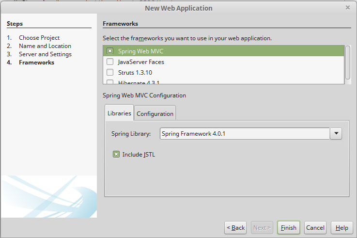
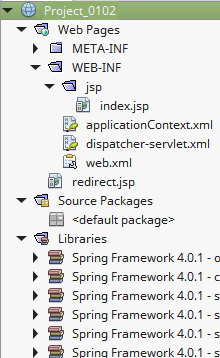
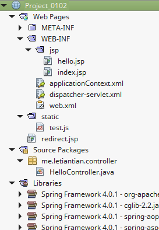
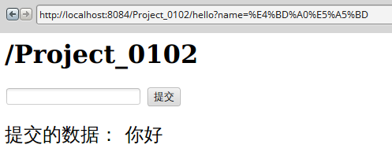

01-02、使用Spring MVC构建Hello World
---

本文演示如何使用Spring MVC做出最简单的Hello World应用。

## 示例1
项目创建和之前一样，不过在最后一步要选择Spring Web MVC：  
  

项目结构如下：  
  

### web.xml源码：
```xml
<?xml version="1.0" encoding="UTF-8"?>
<web-app version="3.1" xmlns="http://xmlns.jcp.org/xml/ns/javaee" xmlns:xsi="http://www.w3.org/2001/XMLSchema-instance" xsi:schemaLocation="http://xmlns.jcp.org/xml/ns/javaee http://xmlns.jcp.org/xml/ns/javaee/web-app_3_1.xsd">
    <context-param>
        <param-name>contextConfigLocation</param-name>
        <param-value>/WEB-INF/applicationContext.xml</param-value>
    </context-param>

    <listener>
        <listener-class>org.springframework.web.context.ContextLoaderListener</listener-class>
    </listener>

    <servlet>
        <servlet-name>dispatcher</servlet-name>
        <servlet-class>org.springframework.web.servlet.DispatcherServlet</servlet-class>
        <load-on-startup>2</load-on-startup>
    </servlet>

    <servlet-mapping>
        <servlet-name>dispatcher</servlet-name>
        <url-pattern>*.htm</url-pattern>
    </servlet-mapping>

    <session-config>
        <session-timeout>
            30
        </session-timeout>
    </session-config>
    <welcome-file-list>
        <welcome-file>redirect.jsp</welcome-file>
    </welcome-file-list>
</web-app>
```  
如果遇到匹配*.htm的URL，会使用`org.springframework.web.servlet.DispatcherServlet`来处理。

### applicationContext.xml源码：
```xml
<?xml version='1.0' encoding='UTF-8' ?>
<!-- was: <?xml version="1.0" encoding="UTF-8"?> -->
<beans xmlns="http://www.springframework.org/schema/beans"
       xmlns:xsi="http://www.w3.org/2001/XMLSchema-instance"
       xmlns:p="http://www.springframework.org/schema/p"
       xmlns:aop="http://www.springframework.org/schema/aop"
       xmlns:tx="http://www.springframework.org/schema/tx"
       xsi:schemaLocation="http://www.springframework.org/schema/beans http://www.springframework.org/schema/beans/spring-beans-4.0.xsd
       http://www.springframework.org/schema/aop http://www.springframework.org/schema/aop/spring-aop-4.0.xsd
       http://www.springframework.org/schema/tx http://www.springframework.org/schema/tx/spring-tx-4.0.xsd">

    <!--bean id="propertyConfigurer"
          class="org.springframework.beans.factory.config.PropertyPlaceholderConfigurer"
          p:location="/WEB-INF/jdbc.properties" />

<bean id="dataSource"
    class="org.springframework.jdbc.datasource.DriverManagerDataSource"
    p:driverClassName="${jdbc.driverClassName}"
    p:url="${jdbc.url}"
    p:username="${jdbc.username}"
    p:password="${jdbc.password}" /-->

    <!-- ADD PERSISTENCE SUPPORT HERE (jpa, hibernate, etc) -->

</beans>
```
applicationContext.xml是Spring的配置文件。  

### dispatcher-servlet.xml源码：
```xml
<?xml version='1.0' encoding='UTF-8' ?>
<!-- was: <?xml version="1.0" encoding="UTF-8"?> -->
<beans xmlns="http://www.springframework.org/schema/beans"
       xmlns:xsi="http://www.w3.org/2001/XMLSchema-instance"
       xmlns:p="http://www.springframework.org/schema/p"
       xmlns:aop="http://www.springframework.org/schema/aop"
       xmlns:tx="http://www.springframework.org/schema/tx"
       xsi:schemaLocation="http://www.springframework.org/schema/beans http://www.springframework.org/schema/beans/spring-beans-4.0.xsd
       http://www.springframework.org/schema/aop http://www.springframework.org/schema/aop/spring-aop-4.0.xsd
       http://www.springframework.org/schema/tx http://www.springframework.org/schema/tx/spring-tx-4.0.xsd">

    <bean class="org.springframework.web.servlet.mvc.support.ControllerClassNameHandlerMapping"/>

    <!--
    Most controllers will use the ControllerClassNameHandlerMapping above, but
    for the index controller we are using ParameterizableViewController, so we must
    define an explicit mapping for it.
    -->
    <bean id="urlMapping" class="org.springframework.web.servlet.handler.SimpleUrlHandlerMapping">
        <property name="mappings">
            <props>
                <prop key="index.htm">indexController</prop>
            </props>
        </property>
    </bean>

    <bean id="viewResolver"
          class="org.springframework.web.servlet.view.InternalResourceViewResolver"
          p:prefix="/WEB-INF/jsp/"
          p:suffix=".jsp" />

    <!--
    The index controller.
    -->
    <bean name="indexController"
          class="org.springframework.web.servlet.mvc.ParameterizableViewController"
          p:viewName="index" />

</beans>
```

在`<bean id="viewResolver" .../>`定义了JSP模板文件的位置和后缀（这样其他地方就可以省略后缀了）。  

URL为`index.htm`时，对应的控制器是`indexController`，其调用了`/WEB-INF/jsp/`下的模板`index.jsp`。

### redirect.jsp源码
```jsp
<%@page contentType="text/html" pageEncoding="UTF-8"%>
<% response.sendRedirect("index.htm"); %>
```

### index.jsp源码

```html
<%@page contentType="text/html" pageEncoding="UTF-8"%>
<!DOCTYPE HTML PUBLIC "-//W3C//DTD HTML 4.01 Transitional//EN"
    "http://www.w3.org/TR/html4/loose.dtd">

<html>
    <head>
        <meta http-equiv="Content-Type" content="text/html; charset=UTF-8">
        <title>Welcome to Spring Web MVC project</title>
    </head>

    <body>
        <p>Hello! This is the default welcome page for a Spring Web MVC project.</p>
        <p><i>To display a different welcome page for this project, modify</i>
            <tt>index.jsp</tt> <i>, or create your own welcome page then change
                the redirection in</i> <tt>redirect.jsp</tt> <i>to point to the new
                welcome page and also update the welcome-file setting in</i>
            <tt>web.xml</tt>.</p>
    </body>
</html>
```

运行项目，打开浏览器访问`http://localhost:8084/Project_0102/`，会自动跳转到
`http://localhost:8084/Project_0102/index.htm`，并显示`index.jsp`的内容。

### Hello World
修改dispatcher-servlet.xml，将`<bean id="urlMapping" .../>`修改为：  
```xml
<bean id="urlMapping" class="org.springframework.web.servlet.handler.SimpleUrlHandlerMapping">
    <property name="mappings">
        <props>
            <prop key="index.htm">indexController</prop>
            <prop key="hello.htm">helloController</prop>
        </props>
    </property>
</bean>
```

并添加：  
```xml
<bean name="helloController"
      class="me.letiantian.controller.HelloController" />
```

HelloController.java的源码如下：  
```java
package me.letiantian.controller;

import javax.servlet.http.HttpServletRequest;
import javax.servlet.http.HttpServletResponse;
import org.springframework.web.servlet.ModelAndView;
import org.springframework.web.servlet.mvc.Controller;

public class HelloController implements  Controller{

    @Override
    public ModelAndView handleRequest(HttpServletRequest request, HttpServletResponse response) throws Exception {

        ModelAndView mv = new ModelAndView();
        mv.addObject("message", "Hello World!你好");  
        mv.setViewName("hello");
        return mv;
    }

}
```
模板`hello.jsp`的源码如下：
```html
<html>
    <head>
        <title>Hello world</title>
    </head>
    <body>
        <h1>${message}</h1>
    </body>
</html>
```

创建static目录，在static目录下创建test.js，内容如下：
```js
console.log("hello world");
```

在`web.xml`中添加：
```xml
<servlet-mapping>  
    <servlet-name>default</servlet-name>
    <url-pattern>*.jpg</url-pattern>   
</servlet-mapping>  

<servlet-mapping>  
    <servlet-name>default</servlet-name>
    <url-pattern>*.png</url-pattern>   
</servlet-mapping>  

<servlet-mapping>    
    <servlet-name>default</servlet-name>  
    <url-pattern>*.js</url-pattern>  
</servlet-mapping>  

<servlet-mapping>    
    <servlet-name>default</servlet-name>    
    <url-pattern>*.css</url-pattern>   
</servlet-mapping>
```

好了，现在的项目结构如下：  
  

浏览器访问结果：  
   
   

乱码了~囧~

**解决方法：**  
在`HelloController.java`加入`response.setContentType("text/html;charset=UTF-8");`：
```java
package me.letiantian.controller;

import javax.servlet.http.HttpServletRequest;
import javax.servlet.http.HttpServletResponse;
import org.springframework.web.servlet.ModelAndView;
import org.springframework.web.servlet.mvc.Controller;

public class HelloController implements  Controller{

    @Override
    public ModelAndView handleRequest(HttpServletRequest request, HttpServletResponse response) throws Exception {
        response.setContentType("text/html;charset=UTF-8");  // 新加入的内容
        ModelAndView mv = new ModelAndView();
        mv.addObject("message", "Hello World!你好");  
        mv.setViewName("hello");
        return mv;
    }

}
```


## 示例2

### 换种方法配置静态资源

删掉在`web.xml`中的：
```xml
<servlet-mapping>  
    <servlet-name>default</servlet-name>
    <url-pattern>*.jpg</url-pattern>   
</servlet-mapping>  

<servlet-mapping>  
    <servlet-name>default</servlet-name>
    <url-pattern>*.png</url-pattern>   
</servlet-mapping>  

<servlet-mapping>    
    <servlet-name>default</servlet-name>  
    <url-pattern>*.js</url-pattern>  
</servlet-mapping>  

<servlet-mapping>    
    <servlet-name>default</servlet-name>    
    <url-pattern>*.css</url-pattern>   
</servlet-mapping>
```
在`dispatcher-servlet.xml`中增加以下内容：
```xml
<?xml version='1.0' encoding='UTF-8' ?>
<!-- was: <?xml version="1.0" encoding="UTF-8"?> -->
<beans xmlns="http://www.springframework.org/schema/beans"
       xmlns:xsi="http://www.w3.org/2001/XMLSchema-instance"
       xmlns:p="http://www.springframework.org/schema/p"
       xmlns:aop="http://www.springframework.org/schema/aop"
       xmlns:tx="http://www.springframework.org/schema/tx"
       xmlns:mvc="http://www.springframework.org/schema/mvc"
       xsi:schemaLocation="http://www.springframework.org/schema/beans http://www.springframework.org/schema/beans/spring-beans-4.0.xsd
       http://www.springframework.org/schema/aop http://www.springframework.org/schema/aop/spring-aop-4.0.xsd
       http://www.springframework.org/schema/tx http://www.springframework.org/schema/tx/spring-tx-4.0.xsd
       http://www.springframework.org/schema/mvc http://www.springframework.org/schema/mvc/spring-mvc-4.0.xsd">

    <!-- 其他内容 -->
    <mvc:resources mapping="/static/**" location="/static/"/>  

</beans>
```

注意，在beans的属性中增加了`xmlns:mvc="http://www.springframework.org/schema/mvc"`，属性`xsi:schemaLocation`中增加了`http://www.springframework.org/schema/mvc http://www.springframework.org/schema/mvc/spring-mvc-4.0.xsd`。


### 不再使用任何后缀（例如.html，.jsp）

将`redirect.jsp`修改为：  
```jsp
<%@page contentType="text/html" pageEncoding="UTF-8"%>
<% response.sendRedirect("index"); %>
```

将web.xml中的：  
```xml
<servlet-mapping>
    <servlet-name>dispatcher</servlet-name>
    <url-pattern>*.htm</url-pattern>
</servlet-mapping>
```

修改为：
```xml
<servlet-mapping>
    <servlet-name>dispatcher</servlet-name>
    <url-pattern>/</url-pattern>
</servlet-mapping>
```

将`dispatcher-servlet.xml`中的：
```xml
<bean id="urlMapping" class="org.springframework.web.servlet.handler.SimpleUrlHandlerMapping">
    <property name="mappings">
        <props>
            <prop key="index.htm">indexController</prop>
            <prop key="hello.htm">helloController</prop>
        </props>
    </property>
</bean>
```

修改为：
```xml
<bean id="urlMapping" class="org.springframework.web.servlet.handler.SimpleUrlHandlerMapping">
    <property name="mappings">
        <props>
            <prop key="index">indexController</prop>
            <prop key="hello">helloController</prop>
        </props>
    </property>
</bean>
```

然后，浏览器访问`http://localhost:8084/Project_0102/hello`。


## 示例3

这个示例展示如何获取URL中的数据。

修改`HelloController.java`:  
```java
package me.letiantian.controller;

import javax.servlet.http.HttpServletRequest;
import javax.servlet.http.HttpServletResponse;
import org.springframework.web.servlet.ModelAndView;
import org.springframework.web.servlet.mvc.Controller;

public class HelloController implements  Controller{

    @Override
    public ModelAndView handleRequest(HttpServletRequest request, HttpServletResponse response) throws Exception {
        response.setContentType("text/html;charset=UTF-8");
        ModelAndView mv = new ModelAndView();
        mv.addObject("name", request.getParameter("name"));  
        mv.setViewName("hello");
        return mv;
    }

}
```

修改`hello.jsp`：
```html
<%@page contentType="text/html" pageEncoding="UTF-8"%>
<html>
    <head>
        <title>Hello world</title>
    </head>
    <body>
        <h1>${pageContext.request.contextPath}</h1>

        <form action="${pageContext.request.contextPath}/hello" method="GET">
            <input name="name" />
            <input type="submit" value="提交"/>
        </form>

        <h2>提交的数据： ${name}</h2>

    </body>
</html>
```
`${pageContext.request.contextPath}`的输出是`/Project_0102`。  
浏览器访问：  
  

再编辑JSP文件时候遇到了这样的问题：

> The header.jspf contains characters which will probably be damaged during
conversion to the ISO-8859-1 character set.
Do you want to save the file using this character set?

解决办法见[http://stackoverflow.com/questions/15499182/netbeans-forces-me-to-save-in-specific-encoding](http://stackoverflow.com/questions/15499182/netbeans-forces-me-to-save-in-specific-encoding)。

## 资料
- [Chapter 13. Web MVC framework](http://docs.spring.io/spring/docs/2.5.x/reference/mvc.html)
- [Spring MVC – How to include JS or CSS files in a JSP page](http://www.mkyong.com/spring-mvc/spring-mvc-how-to-include-js-or-css-files-in-a-jsp-page/)  

- [dispatcher-servlet.xml and application-context.xml的区别](http://stackoverflow.com/questions/4549034/dispatcher-servlet-xml-and-application-context-xml)  

- [Spring MVC SimpleUrlHandlerMapping example](http://www.mkyong.com/spring-mvc/spring-mvc-simpleurlhandlermapping-example/)  
- [springMVC中文乱码问题](http://blog.csdn.net/xuechongyang/article/details/8283924)  
- [SpringMVC 基于注解的Controller @RequestMapping @RequestParam.. ](http://blog.csdn.net/lufeng20/article/details/7598801)

- urlMapping也可以通过注解来定义，例如[Spring 4 MVC Hello World Tutorial – Full Example](http://javahash.com/spring-4-mvc-hello-world-tutorial-full-example/)。  
